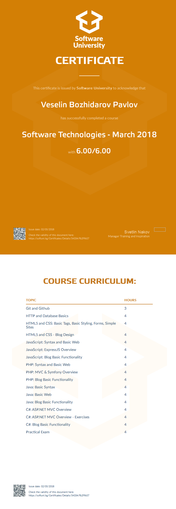

# Course: Software Technologies (C#, Java, JavaScript, PHP)

## Topics:
01. Git and Github
02. HTTP and Database
03. HTML5 and CSS
04. JavaScript Basic Syntax
05. JavaScript ExpressJS Overview
06. PHP Basic Syntax
07. PHP MVC and Symfony Overview
08. Java Basic Syntax
09. Java MVC and Spring Overview
10. C# ASP.NET MVC Overview

## Status:
Completed

## Certificate:

